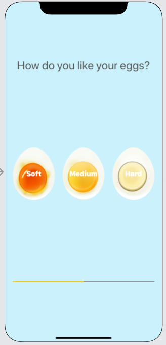

# Egg Timer
 
## Challenges I Faced?

I had difficulty understanding how to put the underlying logic of a eggtimer app in Swift.

## How Did I Over Come Those Challenges? 

I wanted to be sure that I was thinking programmatically, so my first step was to draw out my desired result plainly in common english on a white board. Once I had somewhat of a mental path for the underlying logic of the egg timer app I was then able to tailor my research accordingly. By leveraging platforms like Google, YouTube, MDN docs, Stackoverflow, GitHub, online courses, and reference guides I was able to find the proper swift methods and functions needed to complete the task. 

## What I Learned

* Swift Collection types - Dictionaries
* The Swift Timer API
* Conditional statements - IF/ELSE
* Conditional statements - Switch
* Functions with outputs
* How to use the ProgressView

